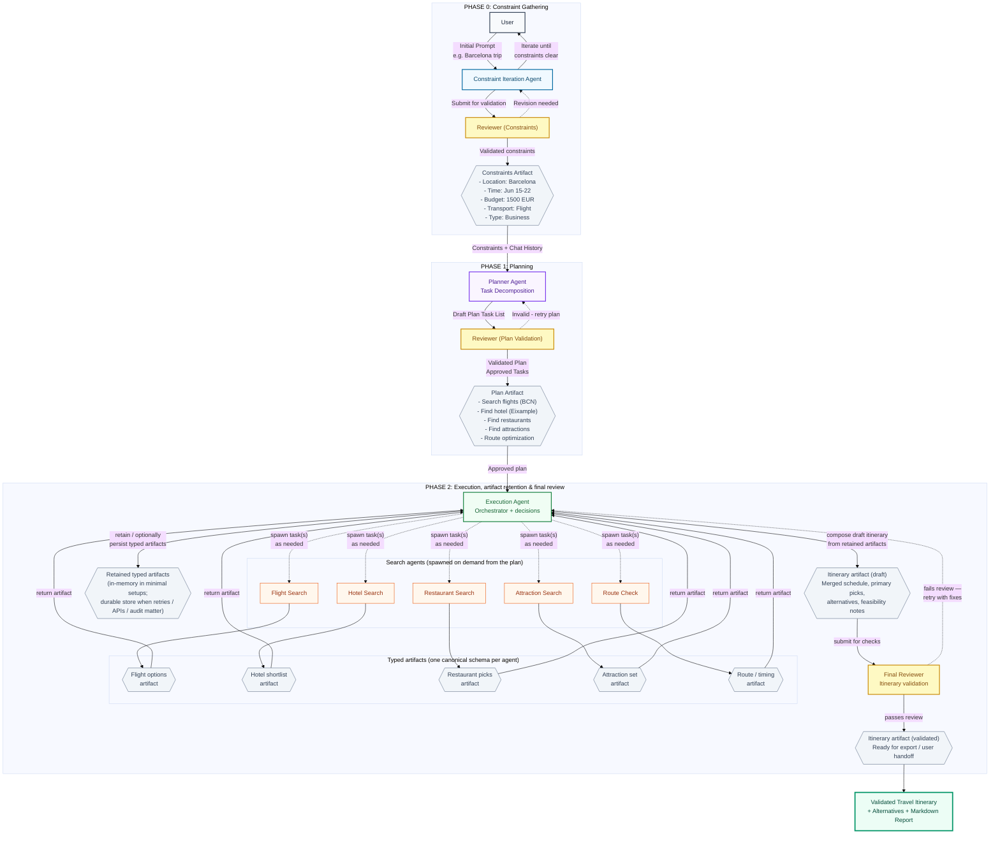
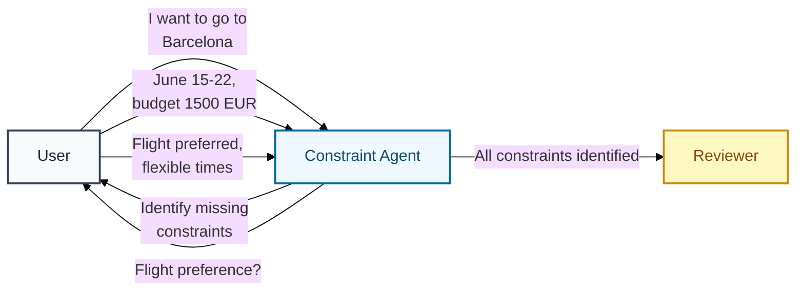
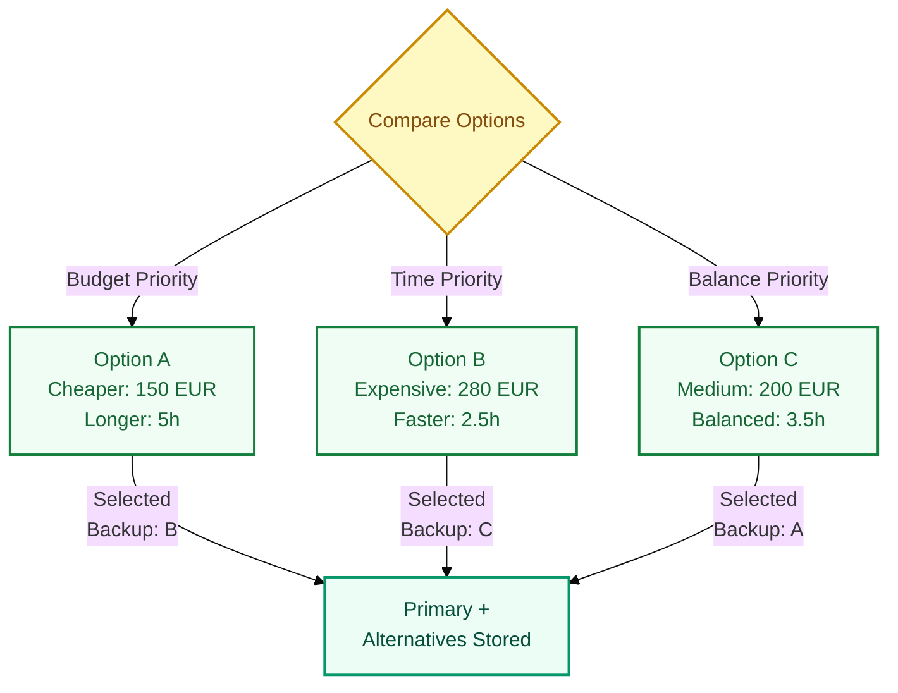
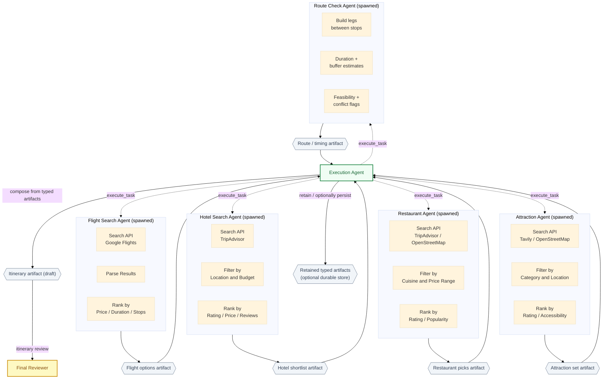
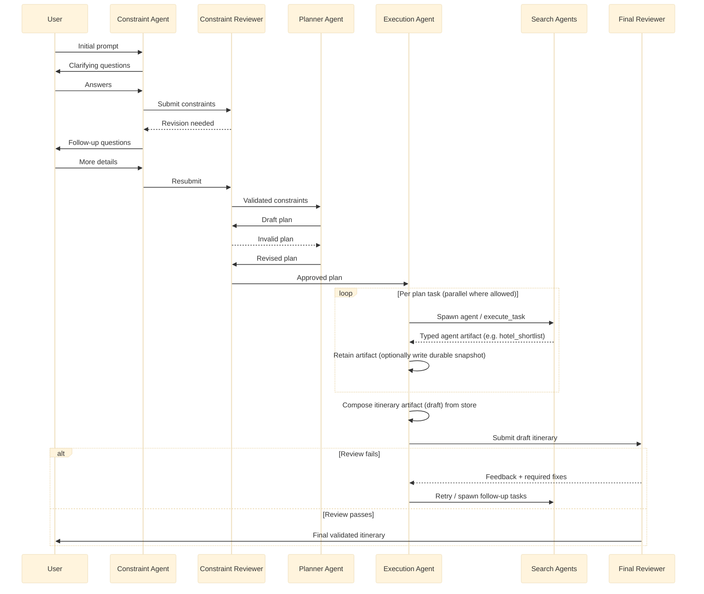
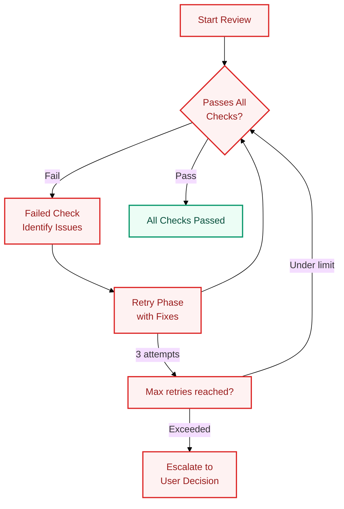

# Multi-Agent Travel Planning System - Architecture

## System Architecture Overview



---

## Phase 0: Constraint Gathering (Iteration Loop)

### Purpose
Before deep research begins, the **Constraint-Iteration Agent** works with the user to gather and clarify all requirements. This prevents expensive iterations during the research phase.

### How It Works



### Constraint Types

| Category | Examples | Required? |
|----------|----------|-----------|
| **Location** | Destination city, neighborhoods, landmarks | ✅ Yes |
| **Time** | Start date, end date, preferred days/times | ✅ Yes |
| **Budget** | Max cost, currency, spending priorities | Optional |
| **Transport** | Flight, train, car, bus preferences | Optional |
| **Purpose** | Business, vacation, honeymoon, family | Optional |
| **Preferences** | Cuisine types, activity levels, mobility needs | Optional |

### Output Artifact

```json
{
  "location": {
    "destination": "Barcelona",
    "areas": ["Eixample", "Gothic Quarter"]
  },
  "time": {
    "start": "2024-06-15",
    "end": "2024-06-22",
    "flexible": false
  },
  "budget": {
    "max": 1500,
    "currency": "EUR",
    "priority": "accommodation"
  },
  "transport": {
    "type": "flight",
    "departure": "Munich",
    "flexible_times": true
  },
  "purpose": "business_conference",
  "preferences": {
    "cuisine": ["Spanish", "Catalan"],
    "activity_level": "moderate"
  }
}
```

---

## Phase 1: Planning & Validation

### Purpose
The **Planner Agent** decomposes the validated constraints into executable tasks. The **Reviewer Agent** validates the plan to ensure all requirements are covered.

### Task Types

| Task Type | Agent | Output |
|------------|-------|--------|
| `flight_search` | Flight Search Agent | Top 3 options with prices/times |
| `hotel_search` | Hotel Search Agent | Top 3 options with location/amenities |
| `restaurant_search` | Restaurant Agent | Recommendations by cuisine/price |
| `attraction_search` | Attraction Agent | Must-see + hidden gems |
| `route_optimization` | Route Agent | Optimized daily schedule |

### Plan Artifact Example

```json
{
  "plan_id": "plan_2024_001",
  "constraints_ref": "constraints_2024_001",
  "tasks": [
    {
      "id": 1,
      "type": "flight_search",
      "priority": 1,
      "params": {
        "from": "Munich",
        "to": "BCN",
        "date": "2024-06-15",
        "return": "2024-06-22"
      }
    },
    {
      "id": 2,
      "type": "hotel_search",
      "priority": 2,
      "params": {
        "location": "Eixample",
        "dates": "2024-06-15 to 2024-06-22",
        "budget_max": 800
      },
      "depends_on": [1]
    },
    {
      "id": 3,
      "type": "attraction_search",
      "priority": 3,
      "params": {
        "interests": ["architecture", "art", "history"]
      }
    }
  ],
  "review_status": "approved"
}
```

---

## Phase 2: Execution & Final Review

### Execution Agent Role

The **Execution Agent** is the single orchestrator for Phase 2. It reads the approved plan, **spawns only the search agents that are needed** for each task (some may run in parallel when dependencies allow). **Every search agent returns a single, typed artifact** (its own schema and id); execution never treats Phase 2 output as an anonymous blob.

It **retains each typed artifact** at least until the draft itinerary is built (typically in the orchestrator’s memory). **Durable persistence** (versioned records, provenance, ids for partial reruns) is optional for a small demo, but valuable when the final reviewer may loop (so you do not re-hit every search API), when calls are paid or rate-limited, or when you need an audit trail. From whatever is retained it **materializes a draft itinerary artifact**—primary choices, backups, day-by-day timing, and cost notes. **Only that draft itinerary** is handed to the **Final Reviewer**; on failure, the reviewer sends feedback back to execution, which may spawn additional searches or adjust composition before a new revision.

1. **Spawn-on-demand** — instantiate search agents per plan task, not a fixed static pool every time  
2. **Emit typed artifacts** — each agent produces one canonical artifact (flight options, hotel shortlist, …) with normalized fields and source metadata  
3. **Retain artifacts** — keep each typed document until composition (and longer if using a durable store for retries, cost control, or provenance)  
4. **Compose itinerary artifact** — merge retained typed artifacts into one draft document the reviewer can judge  
5. **Decide under conflict** — price vs. time and similar tradeoffs inform picks and alternatives  
6. **Iterate with reviewer** — draft → review → refine until pass or escalation

### Typed artifacts (Phase 2)

Each spawned search agent **must** hand back an artifact document (JSON or equivalent), not only log text or chat. Names are stable so composition (and optional durable storage) can reference them.

| Agent | Artifact | Typical payload |
|-------|----------|-----------------|
| Flight Search | **Flight options artifact** | Ranked itineraries, carriers, price, duration, booking links |
| Hotel Search | **Hotel shortlist artifact** | Ranked properties, nightly rate, area, amenities |
| Restaurant Search | **Restaurant picks artifact** | Ranked venues, cuisine, price band, hours |
| Attraction Search | **Attraction set artifact** | Ranked sights, categories, estimated visit time |
| Route Check | **Route / timing artifact** | Legs, travel times, feasibility flags between pinned locations |

### Decision Logic



### Search Agents Detail



---

## Final Output Structure

The validated itinerary is delivered as:

### 1. Calendar/Timetable (Primary Output)

```markdown
## Travel Itinerary: Barcelona Business Trip

### Day 1 - June 15 (Monday)
| Time | Activity | Details | Booking |
|------|----------|---------|---------|
| 09:00 | Flight MUC to BCN | LH1134, 2h 15m | Confirmed |
| 12:30 | Check-in Hotel | Hotel Arts, Room 412 | Confirmed |
| 14:00 | Conference Check-in | CCIB, Registration | Required |
| 18:00 | Dinner | Can Culleretes (traditional) | Reservation #1234 |

### Day 2 - June 16 (Tuesday)
| Time | Activity | Details | Booking |
|------|----------|---------|---------|
| 08:00 | Breakfast | Hotel restaurant | Included |
| 09:00 | Conference Day 1 | CCIB Main Hall | Full day |
| 12:30 | Lunch | Taller de Tapas (nearby) | Walk-in |
| 19:00 | Evening | Beach walk, Barceloneta | Free time |

**... continues for duration of trip ...**
```

### 2. Alternatives (Backup Options)

```markdown
## Alternative Options

### Flight Alternatives
| Option | Price | Duration | Times |
|--------|-------|----------|-------|
| Selected | 180 EUR | 2h 15m | 09:00-11:15 |
| Alt 1 | 145 EUR | 4h 30m | 06:30+stop |
| Alt 2 | 220 EUR | 2h 05m | 19:45-21:50 |

### Hotel Alternatives
| Option | Price/night | Rating | Notes |
|--------|-------------|--------|-------|
| Selected | 120 EUR | 4 stars | Arts district |
| Alt 1 | 95 EUR | 3 stars | Gothic Quarter |
| Alt 2 | 150 EUR | 5 stars | Beachfront |
```

### 3. Markdown Report

Full formatted document with:
- Executive summary
- Daily breakdown
- Cost summary
- Important contacts
- Packing recommendations

---

## Agent Communication Protocol

### Artifact Flow



### Message Types

| From → To | Message Type | Content |
|------------|--------------|---------|
| User → Constraint | `prompt` | Initial travel request |
| Constraint → User | `clarification` | Questions to user |
| Constraint → Reviewer | `submit` | Final constraints |
| Reviewer → Constraint | `revision` | Changes needed |
| Planner → Reviewer | `plan_draft` | Proposed task list |
| Reviewer → Planner | `plan_feedback` | Approval or changes |
| Execution → Search | `execute_task` | Task with parameters |
| Flight Search → Execution | `flight_options_artifact` | Canonical flight-options document |
| Hotel Search → Execution | `hotel_shortlist_artifact` | Canonical hotel shortlist document |
| Restaurant Search → Execution | `restaurant_picks_artifact` | Canonical restaurant picks document |
| Attraction Search → Execution | `attraction_set_artifact` | Canonical attraction set document |
| Route Check → Execution | `route_timing_artifact` | Legs, times, feasibility flags |
| Execution → Persistence | `artifact_persist` | Optional: versioned snapshots when using a durable store |
| Execution → Reviewer | `itinerary` | Draft itinerary artifact (composed from store) |
| Reviewer → Execution | `review_result` | Validation status |

---

## Review Loop Mechanism

### Retry Logic



### Review Criteria

| Check | What It Validates |
|-------|-------------------|
| **Constraint Coverage** | All user constraints addressed |
| **Temporal Validity** | Times don't conflict, realistic travel |
| **Budget Compliance** | Total cost ≤ user budget |
| **Completeness** | All days have activities |
| **Feasibility** | Travel times between locations are possible |
| **Alternatives** | Backup options available for key decisions |

---

## System Constants

| Parameter | Value | Rationale |
|-----------|-------|-----------|
| **Max Retries** | 3 | Prevent infinite loops |
| **Search Results** | Top 3 per category | Balance quality vs. cognitive load |
| **Alternative Options** | 2 per primary | Give user choice without overwhelming |
| **Reviewer Model** | Higher capability | Better validation quality |

---

## Key Design Decisions

| Decision | Rationale |
|----------|-----------|
| **Constraint-Iteration before Planner** | Front-loading simplifies later phases; iteration in research mode is complex |
| **Execution Agent makes decisions** | Needs judgment when options conflict (e.g., cheaper flight = longer time) |
| **General Web Search for edge cases** | Handles queries that don't fit specialized agents |
| **Timetable as primary output** | iCal format enables calendar integration |
| **Search agents spawn on demand; one typed artifact each** | Clear contracts per agent (schemas, ids); composition consumes structured documents, not chat. Durable persistence is recommended when reviewer loops or external APIs make re-fetching expensive |
| **3 max retries** | Prevent infinite loops |
| **Always provide alternatives** | User autonomy, handle preferences not explicitly stated |

---

## Legend


**Node Types:**
- **User Node** (gray) - Human actor
- **Constraint Node** (blue) - Constraint gathering phase
- **Planner Node** (purple) - Task decomposition
- **Reviewer Node** (amber) - Validation/approval
- **Executor Node** (green) - Orchestration/execution
- **Search Node** (orange) - Specialized search agents
- **Artifact Node** (slate) - Data/artifacts between phases
- **Output Node** (emerald) - Final validated output

