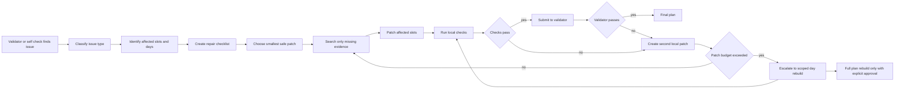

# Ideal General Repair Pattern

This pattern is designed to prevent failures like `query_8`, where the agent repeatedly called `init_plan`, rebuilt the full 12-day itinerary five times, and only then reached the first validator.

## Core Idea

The repair layer should prefer targeted patches over full-plan rebuilds.

`init_plan` should not be available as a normal repair tool once the plan already contains days or slots. A full rebuild should require an explicit escalation decision.

## Mermaid Diagram

Raw Mermaid file: `error_analysis/ideal_repair_pattern.mmd`

## Repair Steps

| Step | Purpose | Example for `query_8` |
|---|---|---|
| Classify issue type | Decide whether the issue is budget, route, evidence, timing, opening hours, or missing requirement | Budget and return-flight logic |
| Identify affected scope | Locate exact slots and days that need edits | Flight slots, lodging cost, high-cost food or nightlife slots |
| Create repair checklist | Convert validator feedback into concrete fixes | Lower total under EUR 9000; simplify return flight; keep food budget realistic |
| Choose smallest safe patch | Avoid touching unrelated days | Replace flights and lodging first, not all 12 days |
| Search only missing evidence | Search for the exact missing facts | Cheaper return flights, hostel price, Ghibli booking evidence |
| Patch affected slots | Use `delete_slot`, `insert_slot`, or `add_slot` only where needed | Update Day 1 flight, Day 12 return, lodging slot, selected meal budgets |
| Run local checks | Verify budget, route timing, overlaps, and required interests before validator | `cost_summary`, route timing, duplicate slot checks |
| Escalate only if needed | Move from slot patch to day rebuild only after local patches fail | Rebuild Day 12 if return flight changes the arrival structure |
| Full rebuild last | Reinitialize only when the existing plan is structurally unrecoverable | Do not call `init_plan` unless most days are invalid |

## Guardrails

| Guardrail | Rule |
|---|---|
| `init_plan` lock | Disable `init_plan` after the first successful `add_day` unless escalation is approved |
| Patch budget | Stop after a fixed number of edits to the same day or slot position |
| Locality rule | A validator complaint about one flight should not rewrite unrelated meals and attractions |
| Evidence gate | Do not add or keep a slot if its evidence link cannot verify price, hours, or location |
| Cost gate | Run `cost_summary` after each budget-related patch batch |
| Route gate | Run route checks after transport or day-order changes |
| Retry cap | Maximum 2 local patch cycles before escalating to scoped rebuild |

## What This Would Change For Query 8

| Query 8 behavior | Ideal repair behavior |
|---|---|
| `init_plan x5` before first validator | `init_plan x1`, then patch locally |
| `add_day x60` from five full rebuilds | `add_day x12` once |
| Broad rewrites across 8 to 9 days | Edits limited to flight, lodging, budget, and affected food/nightlife slots |
| Validator sees a plan after 40 minutes | Validator sees an earlier first complete draft |
| Repair is mutation-heavy | Repair is checklist-driven and scoped |

## Slide Takeaway

The ideal repair loop should be:

**diagnose -> scope -> patch locally -> verify locally -> validate -> escalate only if necessary**

Not:

**notice issue -> reset plan -> rebuild everything -> repeat**
