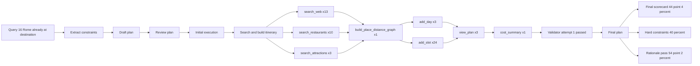
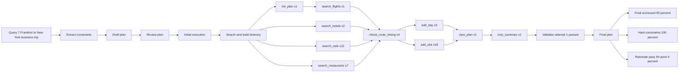
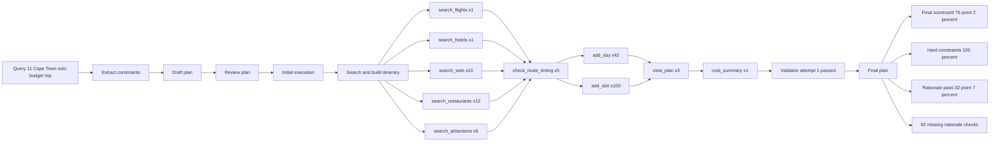
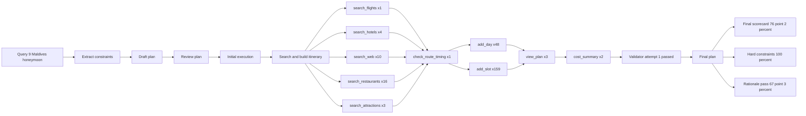
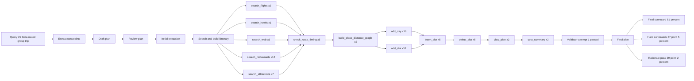
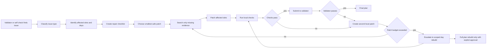

# Error Analysis

**Where do the remaining failures come from?**

- Compared final scorecards with LangSmith traces for `baseline` and `travel_agent`
- Used exact user-query matching only, to avoid mixing different benchmark instances
- Analyzed 15 evaluated queries, 2,300 real Travel Agent tool runs, and 193 baseline tool calls
- Added validator-repair analysis: 6 failed validator attempts across 4 repair threads
- Important caveat: full LangSmith message/tool exports duplicate LangGraph state snapshots; execution-level counts use `run_type == "tool"`

**Main question:** is the failure caused by bad search, bad evaluation, or plan-repair behavior?

---

# Error Signals by Component

**Most errors are not repeated web searches. They appear in the TravelPlan mutation layer.**

| Component group | Tool calls | Repeated calls | Loop indicators | Error/timeout language | Uncertainty outputs |
|---|---:|---:|---:|---:|---:|
| Domain/search tools | 618 | 0 | 0 | 172 | 181 |
| State-management tools | 123 | 10 | 0 | 0 | 66 |
| TravelPlan mutation tools | 1,559 | 413 | 104 | 38 | 131 |

**Interpretation**

- Search tools usually do not loop, but often return weak or uncertain evidence
- Execution agent then repeatedly mutates the shared itinerary with `add_slot`, `delete_slot`, `insert_slot`, and `add_day`
- This creates repair churn: local fixes can introduce global consistency problems

**Trace shape:** baseline is search-only in our local trace view; Travel Agent adds 1,413 mutation calls and 195 read/check calls on top of search.

---

# Representative Failure Case: Tokyo Group Trip

**`query_8`: highest trace instability**

| Metric | Travel Agent |
|---|---:|
| Scorecard pass rate | 90.5% |
| Hard-constraint pass rate | 100.0% |
| Rationale pass rate | 60.4% |
| Real tool calls | 536 |
| TravelPlan mutation calls | 436 |
| Loop indicators | 66 |
| Cascade indicators | 192 |
| Validation attempts | 3 |

**What happened**

- Final answer looks mostly valid by hard constraints
- Trace shows heavy repair behavior before the final plan
- Main failure mode is not “agent cannot search”; it is “agent keeps editing the plan to satisfy competing constraints”

---

# Query 8 Graph: Repair-Heavy Success

**`query_8`: highest trace instability**

| Metric | Travel Agent |
|---|---:|
| Scorecard pass rate | 90.5% |
| Hard-constraint pass rate | 100.0% |
| Rationale pass rate | 60.4% |
| Real tool calls | 536 |
| TravelPlan mutation calls | 436 |
| Loop indicators | 66 |
| Cascade indicators | 192 |
| Validation attempts | 3 (passed on attempt 3) |
| Runtime Minutes | 40 minutes |
| Total tokens | 18,145,946 |

```mermaid
flowchart LR
  A[Query 8 Tokyo group trip]
  B[Extract constraints]
  C[Draft plan]
  D[Review plan]
  E[Initial execution]
  F[Search and build itinerary]
  IP["init_plan x5"]
  ISF["search_flights x6"]
  ISH["search_hotels x4"]
  ISW["search_web x10"]
  ISR["search_restaurants x14"]
  ISA["search_attractions x14"]
  IRT["check_route_timing x5"]
  IAD["add_day x60 from 5 full 12 day rebuilds"]
  IAS["add_slot x197"]
  IDEL["delete_slot x26"]
  IINS["insert_slot x19"]
  ICHK["view_plan x21 and cost_summary x9"]
  G[Validator attempt 1 failed]
  H[Problems: over budget; impossible return connection; flight cost and routing confused]
  I[Repair 1]
  SF["search_flights x3"]
  SH["search_hotels x3"]
  SW["search_web x1"]
  DEL["delete_slot x14"]
  INS["insert_slot x9"]
  ADD["add_slot x3"]
  J[26 mutations across 8 days]
  K[Validator attempt 2 failed]
  L[Problems: return flight too complex; food budget unrealistic; nightlife missing; Ghibli booking missing]
  M[Repair 2]
  FLIGHT2["search_flights x10"]
  WEB2["search_web x8"]
  HOTEL2["search_hotels x1"]
  DEL2["delete_slot x30"]
  ADD2["add_slot x27"]
  INS2["insert_slot x3"]
  N[60 mutations across 9 days]
  O[Validator attempt 3 passed]
  P[Final plan]
  Q[Final scorecard 90 point 5 percent]

  A --> B
  B --> C
  C --> D
  D --> E
  E --> F
  F --> IP
  IP --> ISF
  F --> ISH
  F --> ISW
  F --> ISR
  F --> ISA
  ISF --> IRT
  ISH --> IRT
  ISW --> IRT
  ISR --> IRT
  ISA --> IRT
  IRT --> IAD
  IRT --> IAS
  IAD --> IDEL
  IAS --> IDEL
  IDEL --> IINS
  IINS --> ICHK
  ICHK --> G
  G --> H
  H --> I
  I --> SF
  I --> SH
  I --> SW
  SH --> J
  SF --> J
  SW --> J
  J --> DEL
  J --> INS
  J --> ADD
  ADD --> K
  DEL --> K
  INS --> K
  K --> L
  L --> M
  M --> FLIGHT2
  M --> WEB2
  M --> HOTEL2
  FLIGHT2 --> N
  WEB2 --> N
  HOTEL2 --> N
  N --> DEL2
  N --> ADD2
  N --> INS2
  DEL2 --> O
  ADD2 --> O
  INS2 --> O
  O --> P
  P --> Q
```

**Takeaway:** the final answer scored well, but only after broad validator-driven repair churn.

---

# Query 16 Graph: Smooth Trace, Weak Final Score

**`query_16`: Summary**

| Metric | Travel Agent |
|---|---:|
| Scorecard pass rate | 44.4% |
| Hard-constraint pass rate | 40.0% |
| Rationale pass rate | 54.2% |
| Real tool calls | 65 |
| TravelPlan mutation calls | 32 |
| Loop indicators | 0 |
| Cascade indicators | 7 |
| Validation attempts | 1 (passed on attempt 1) |
| Runtime Minutes | 4 minutes |
| Total tokens | 685,340 |

**Takeaway:** not every failure is a loop. This plan passed internal validation, but final evaluation exposed hard-constraint and evidence/rationale failures.

---

# Query 16 Failure Context

**Why did `query_16` fail so hard?**

| Failure area | What the scorecard saw | Useful context |
|---|---|---|
| Date coverage | `travel_dates` failed 3 of 4 judges | User said July 5 to July 8 with 3 free days; final plan title and days cover July 5 to July 7 only |
| Interests | Interests failed 3 of 4 judges | Hard constraints included Colosseum and Trastevere, but final plan focused on Appian Way, Celio, Ostia Antica, Jewish Ghetto, and hidden gems |
| Accommodation | Accommodation failed 3 of 4 judges | User explicitly said no hotel needed, but generic commonsense checks still expected accommodation planning |
| Transport | Outbound and return transport failed 3 of 4 judges | User was already in Rome, but generic commonsense checks still expected trip-level outbound and return transport |
| Opening hours | Restaurants and attractions had missing info | Many links were Google Maps, Tripadvisor, Rome2Rio, Turbopass, or pages with incomplete fetched text |
| Evidence grounding | 10 missing rationale checks | The final plan used links, but many did not provide retrievable evidence for exact prices, addresses, hours, or route details |

**Main interpretation:** the plan was locally plausible, but the evaluation punished missing explicit fields and weak source retrievability. This is a final-answer/evidence problem, not a dead-loop problem.

**Most important examples**

| Example | Scorecard comment pattern |
|---|---|
| Appian Way and Google Maps links | No retrieved evidence to verify location, cost, or route claims |
| Case Romane del Celio via Turbopass | Evidence did not verify address, price, or Monday opening hours |
| Restaurants via Google Maps links | Venue existence, location, and opening hours could not be verified |
| Ostia Antica official link | Fetched text was incomplete, so Tuesday hours and ticket price were not verified |
| Local transit fare | Plan claimed EUR 2.00, evidence supported EUR 1.50 |

---

# Query 1 Graph: Repaired High Score

**`query_1`: Summary**

| Metric | Travel Agent |
|---|---:|
| Scorecard pass rate | 100.0% |
| Hard-constraint pass rate | 100.0% |
| Rationale pass rate | 46.7% |
| Real tool calls | 106 |
| TravelPlan mutation calls | 55 |
| Loop indicators | 5 |
| Cascade indicators | 32 |
| Validation attempts | 2 (passed on attempt 2) |
| Runtime Minutes | 8 minutes |
| Total tokens | 2,179,430 |

```mermaid
flowchart LR
  A[Query 1 Munich to Vienna city trip]
  B[Extract constraints]
  C[Draft plan]
  D[Review plan]
  E[Initial execution]
  F[Search and build itinerary]
  SW["search_web x18"]
  SR["search_restaurants x10"]
  SA["search_attractions x4"]
  SF["search_flights x1"]
  SH["search_hotels x1"]
  RT["check_route_timing x8"]
  AD["add_day x5"]
  AS["add_slot x32"]
  G[Validator attempt 1 failed]
  H[Problems: transport pass coverage; Sunday opening and timing checks]
  I[Repair 1]
  RSW["search_web x5"]
  RSR["search_restaurants x1"]
  DEL["delete_slot x5"]
  INS["insert_slot x3"]
  ADD["add_slot x2"]
  CHK["view_plan x1 and cost_summary x1"]
  J[10 mutations across 2 days]
  K[Validator attempt 2 passed]
  L[Final plan]
  M[Final scorecard 100 percent]
  N[Rationale pass 46 point 7 percent]

  A --> B
  B --> C
  C --> D
  D --> E
  E --> F
  F --> SW
  F --> SR
  F --> SA
  F --> SF
  F --> SH
  SW --> RT
  SR --> RT
  SA --> RT
  SF --> RT
  SH --> RT
  RT --> AD
  RT --> AS
  AD --> G
  AS --> G
  G --> H
  H --> I
  I --> RSW
  I --> RSR
  I --> CHK
  RSW --> J
  RSR --> J
  CHK --> J
  J --> DEL
  J --> INS
  J --> ADD
  DEL --> K
  INS --> K
  ADD --> K
  K --> L
  L --> M
  L --> N
```

**Takeaway:** final constraints fully passed after one repair cycle, but rationale grounding stayed weak.

---

# Query 7 Graph: Efficient High Score

**`query_7`: Summary**

| Metric | Travel Agent |
|---|---:|
| Scorecard pass rate | 95.0% |
| Hard-constraint pass rate | 100.0% |
| Rationale pass rate | 94.4% |
| Real tool calls | 56 |
| TravelPlan mutation calls | 24 |
| Loop indicators | 1 |
| Cascade indicators | 16 |
| Validation attempts | 1 (passed on attempt 1) |
| Runtime Minutes | 5 minutes |
| Total tokens | 971,916 |

**Takeaway:** this is the clean positive contrast case: low tool use, one validator pass, strong rationale grounding, and no rebuild churn.

---

# Query 11 Graph: Long Plan, Weak Evidence

**`query_11`: Summary**

| Metric | Travel Agent |
|---|---:|
| Scorecard pass rate | 76.2% |
| Hard-constraint pass rate | 100.0% |
| Rationale pass rate | 32.7% |
| Real tool calls | 190 |
| TravelPlan mutation calls | 148 |
| Loop indicators | 9 |
| Cascade indicators | 26 |
| Validation attempts | 1 (passed on attempt 1) |
| Runtime Minutes | 11 minutes |
| Total tokens | 5,762,735 |

**Takeaway:** the internal validator accepted the 21-day plan, but evidence grounding collapsed across many slots.

---

# Query 9 Graph: High Mutation, Passing Validator

**`query_9`: Summary**

| Metric | Travel Agent |
|---|---:|
| Scorecard pass rate | 76.2% |
| Hard-constraint pass rate | 100.0% |
| Rationale pass rate | 67.3% |
| Real tool calls | 258 |
| TravelPlan mutation calls | 216 |
| Loop indicators | 57 |
| Cascade indicators | 15 |
| Validation attempts | 1 (passed on attempt 1) |
| Runtime Minutes | 18 minutes |
| Total tokens | 10,242,724 |

**Takeaway:** hard constraints passed, but heavy construction did not guarantee stronger final rationale grounding.

---

# Query 21 Graph: Mixed Group Tradeoffs

**`query_21`: Summary**

| Metric | Travel Agent |
|---|---:|
| Scorecard pass rate | 81.0% |
| Hard-constraint pass rate | 87.5% |
| Rationale pass rate | 39.2% |
| Real tool calls | 124 |
| TravelPlan mutation calls | 83 |
| Loop indicators | 12 |
| Cascade indicators | 35 |
| Validation attempts | 1 (passed on attempt 1) |
| Runtime Minutes | 9 minutes |
| Total tokens | 3,296,559 |

**Takeaway:** mixed preferences were handled structurally, but evidence quality stayed weak enough to hurt final evaluation.

---

# Error Propagation Pattern

**Common cascade: weak evidence → plan mutation → repair loop**

- Weak evidence followed by later plan mutation: 471 events across 15 threads
- Delete after prior insertion: 128 events across 8 threads
- Validator repair loops: 4 events across 4 threads

**Final-plan symptoms**

- Transport uncertainty in final slots: 74
- Meal slots missing evidence links: 63
- Attraction slots with fragile evidence links: 54
- Meal uncertainty in final slots: 45
- Transport slots with fragile evidence links: 38

**Takeaway:** uncertainty often enters through retrieval, but becomes a final answer problem when it survives mutation and validation.

---

# Validator Repair Loops

**When the itinerary validator rejected a plan, the execution agent repaired it through search + itinerary mutation.**

| Case | Validator requested | Repair scope | Outcome |
|---|---|---:|---|
| Vienna | Transport coverage + Sunday openings | 10 mutations across 2 days | passed |
| Marrakech | Senior-friendly flights + peak-heat pacing | 60 mutations across 8 days | passed |
| Tokyo attempt 1 | Budget + impossible return flight | 26 mutations across 8 days | failed again |
| Tokyo attempt 2 | Simpler return + realistic food/nightlife | 60 mutations across 9 days | passed |
| Amsterdam attempt 1 | Route timing + luggage + event verification | 11 mutations across 3 days | failed again |
| Amsterdam attempt 2 | Luggage contradiction + duplicate restaurant | 4 mutations across 2 days | passed |

**Key observation:** validator feedback was useful, but broad. A single validation complaint often triggered edits across many days, not just the affected slot.

---

# Repair Churn Evidence

**The repair layer sometimes over-edits.**

| Repair attempt | Duplicate day/position groups | Max repeat | Cost movement |
|---|---:|---:|---:|
| Marrakech | 15 | 6x | €3,179 → €2,994 |
| Tokyo attempt 2 | 12 | 7x | €8,619 → €8,619 |
| Tokyo attempt 1 | 4 | 2x | €9,089 → €8,999 |
| Amsterdam attempt 1 | 1 | 2x | €1,412 → €1,412 |

**Interpretation**

- Cost repairs worked when explicitly checked: Tokyo attempt 1 and Marrakech moved under budget
- Route/timing repairs were harder: Tokyo and Amsterdam needed a second validator cycle
- Repeated edits to the same day/position show backtracking in the TravelPlan mutation layer

---

# What This Means for the System

**Travel Agent improves structure, but needs stronger repair control.**

- Travel Agent hard-constraint micro pass rate: 95.2% vs. baseline 93.0%
- Travel Agent hard-constraint macro pass rate: 86.7% vs. baseline 60.0%
- Only 1 of 15 Travel Agent plans fully passed final scorecard checks
- Rationale pass rate is lower than baseline because Travel Agent exposes concrete links, while baseline often gives vague but grader-friendly web snippets
- Validator-repair attempts passed 4 of 6 times on the next validation, but the passing repairs were mutation-heavy

**Error-analysis-driven improvements**

- **Repair planner before mutation:** translate validator feedback into a short checklist before editing the plan
- **Patch only affected slots:** avoid rewriting whole day clusters when the validator flags one flight, meal, or timing issue
- **Add mutation budget:** stop or escalate when repeated `delete_slot` / `add_slot` cycles hit the same day/position repeatedly
- **Evidence gate:** uncertain search results should trigger another search or fallback, not be copied into final slot notes
- **Local re-validation after each fix:** rerun cost, route timing, and overlap checks immediately after each relevant edit batch

**Practical implication:** the next architecture improvement is not “more search.” It is a controlled repair layer between validator feedback and TravelPlan mutation tools.

---

# Ideal Repair Pattern

**Goal:** prevent `query_8` style rebuild churn.

**Key rule:** `init_plan` should be locked after the first successful `add_day`; full rebuilds should be explicit escalations, not normal repairs.
