# Query Flow Mermaid Graphs

These diagrams show how the Travel Agent graph ran from start to end for two representative cases. They use execution-level LangSmith runs from `data/traces/travel_agent_full/langsmith_runs.csv`.

## Query 16: Rome Already At Destination

Trace summary:

- Root run: `019e31a3-434b-7083-8b8c-e909e9119ac5`
- Runtime: about 4.4 minutes
- LangSmith runs: 494
- Real tool calls: 65
- Validation attempts: 1, passed
- Final evaluation: low scorecard case, despite validator passing

```mermaid
flowchart LR
START["User query: already in Rome; 3 free days; no flights or hotel; 400 EUR budget"]
CONSTRAINT["constraint_agent x2: extract hard constraints"]
PLAN["planner_agent x2: draft task list"]
REVIEW["reviewer_agent x1: review planner output"]
FINALPLAN["finalize_planner_output x2"]
EXEC["execution_agent x1"]
INIT["init_plan x1; add_day x3"]
SEARCH["Search subagents: web x13; restaurants x10; attractions x3"]
ROUTE["route check: build_place_distance_graph x1"]
MUTATE["Build itinerary: add_slot x24"]
CHECK["Read/check: view_plan x3; cost_summary x1"]
VALIDATE["itinerary_validator attempt 1: PASS"]
END["Final TravelPlan: Rome Hidden History and Street Food"]
EVAL["Final evaluation: scorecard 44.4%; hard pass 40.0%; rationale pass 54.2%"]

START --> CONSTRAINT
CONSTRAINT --> PLAN
PLAN --> REVIEW
REVIEW --> FINALPLAN
FINALPLAN --> EXEC
EXEC --> INIT
EXEC --> SEARCH
SEARCH --> ROUTE
ROUTE --> MUTATE
INIT --> MUTATE
MUTATE --> CHECK
CHECK --> VALIDATE
VALIDATE --> END
END --> EVAL
```

Interpretation for slides:

- This is not a validator-repair failure: the validator accepted the plan in one attempt.
- The later scorecard found major final-answer issues, especially hard-constraint and rationale/evidence problems.
- This is useful as a contrast case: graph execution can look smooth while final evaluation still fails.

## Query 8: Tokyo Group Trip

Trace summary:

- Root run: `019e30f5-baf1-73e3-9d80-fac667a9d285`
- Runtime: about 40 minutes
- LangSmith runs: 4,004
- Real tool calls: 536
- Validation attempts: 3, passed on attempt 3
- Final evaluation: high apparent hard-constraint quality but very high trace instability

```mermaid
flowchart LR
START["User query: 6 friends; Munich to Tokyo; 9000 EUR; anime, temples, street food, nightlife"]
CONSTRAINT["constraint_agent x2: extract constraints"]
PLAN["planner_agent x2: draft task list"]
REVIEW["reviewer_agent x1"]
FINALPLAN["finalize_planner_output x2"]

EXEC1["execution_agent attempt 1"]
TOOLS1["Initial build: add_day x60; add_slot burst; searches across flights, web, restaurants, attractions, hotels"]
VAL1["itinerary_validator attempt 1: FAIL"]
FB1["Feedback: over budget; impossible return connection; flight cost/routing confused"]

REPAIR1["Repair 1: 44 tool calls"]
R1SEARCH["search_flights x3; search_hotels x3; search_web x1"]
R1MUTATE["26 mutations across 8 days"]
R1COST["cost_summary x4; cost 9089 to 8999 EUR"]
VAL2["itinerary_validator attempt 2: FAIL"]
FB2["Feedback: 4-leg return excessive; food budget unrealistic; nightlife missing; Ghibli booking missing"]

REPAIR2["Repair 2: 93 tool calls"]
R2SEARCH["search_flights x10; search_web x8; search_hotels x1"]
R2MUTATE["60 mutations across 9 days"]
R2REPEAT["12 repeated day-position groups; max repeat 7x"]
VAL3["itinerary_validator attempt 3: PASS"]
END["Final TravelPlan: Tokyo strict-budget trip"]
EVAL["Final evaluation: scorecard 90.5%; hard pass 100%; rationale pass 60.4%"]

START --> CONSTRAINT
CONSTRAINT --> PLAN
PLAN --> REVIEW
REVIEW --> FINALPLAN
FINALPLAN --> EXEC1
EXEC1 --> TOOLS1
TOOLS1 --> VAL1
VAL1 --> FB1
FB1 --> REPAIR1
REPAIR1 --> R1SEARCH
R1SEARCH --> R1MUTATE
R1MUTATE --> R1COST
R1COST --> VAL2
VAL2 --> FB2
FB2 --> REPAIR2
REPAIR2 --> R2SEARCH
R2SEARCH --> R2MUTATE
R2MUTATE --> R2REPEAT
R2REPEAT --> VAL3
VAL3 --> END
END --> EVAL
```

Interpretation for slides:

- This case demonstrates validator-driven repair churn.
- Attempt 1 fixed the budget but did not solve the underlying travel practicality issue.
- Attempt 2 produced a passing plan, but required broad edits across 9 days.
- This is the clearest example that the Travel Agent can reach a good final score through an unstable mutation-heavy process.
