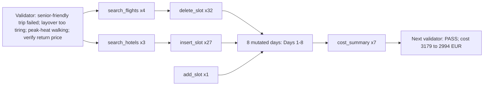
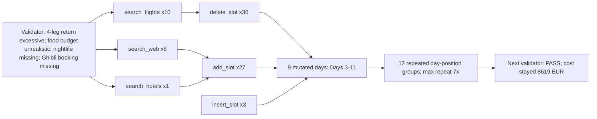
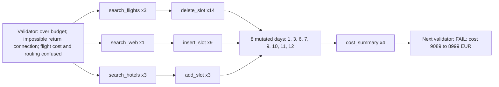
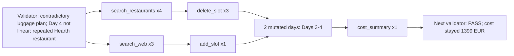
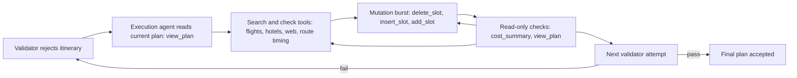

# Repair Flow Visualizations

These Mermaid diagrams use conservative syntax for slide tools that are picky about Mermaid parsing. Copy the whole fenced block, starting at `flowchart LR`.

## Marrakech: Broad Repair After One Validator Failure

## Tokyo Attempt 2: Repair Churn With Successful Outcome

## Tokyo Attempt 1: Cost Fixed, But Validation Still Failed

## Amsterdam Attempt 2: Focused Repair Contrast

## General Repair Pattern

